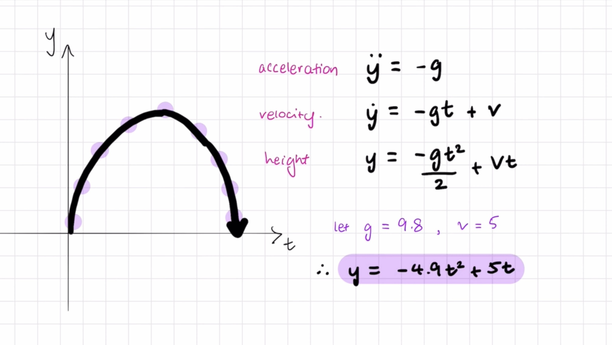

- considerations:

    - acceleration: y'' = -g    // where y'' represents the scecond derivative and -g is gravity

    using integration (the reverse of differentiation), we can find the velocity:

    - velocity: y' = -g(t) + v  // where t is time and v is initial velocity

    furthe integration will give us the height:

    - height: y = -(g(t^2))/2 + v(t) 

    example: let g = 9.8, v = 5 (m/s)

    y = -(9.8(t^2))/2 + 5(t)
      = -4.9(t^2) + 5t